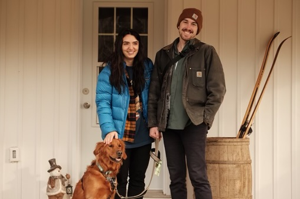
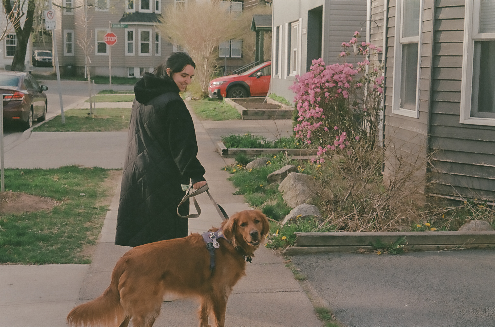
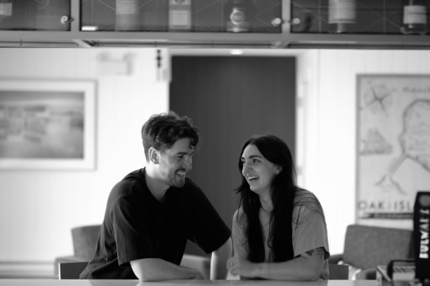
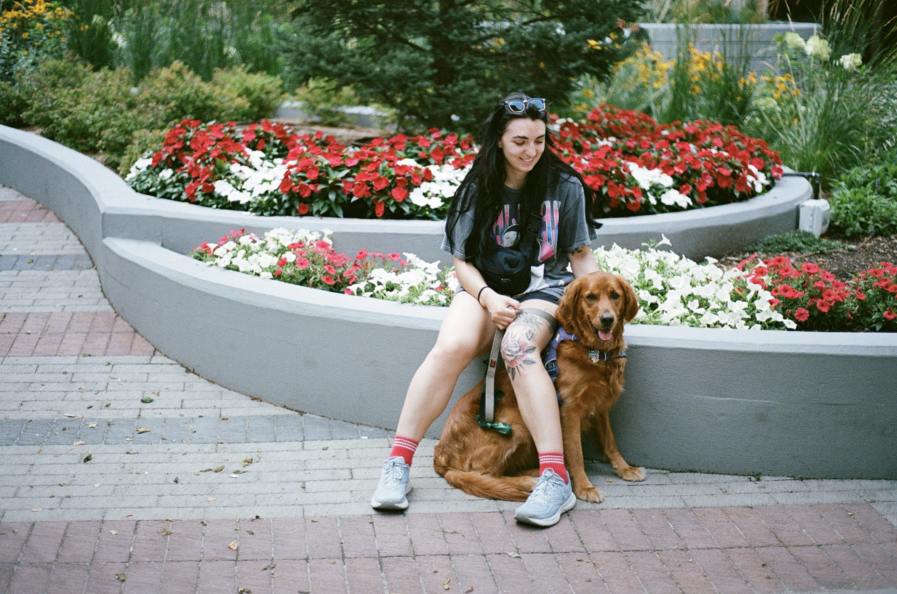
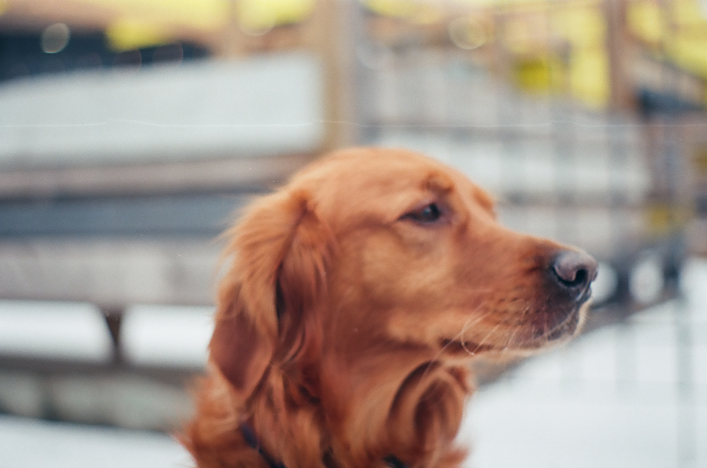
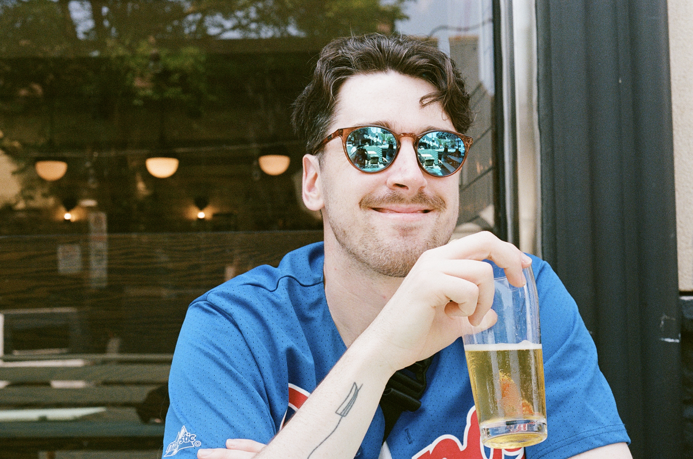
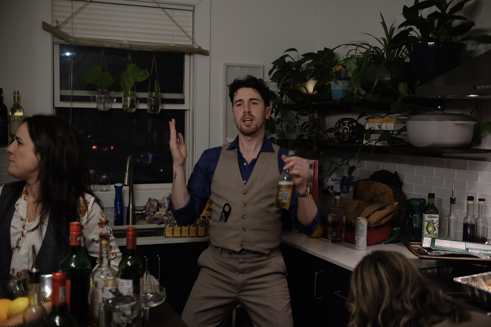
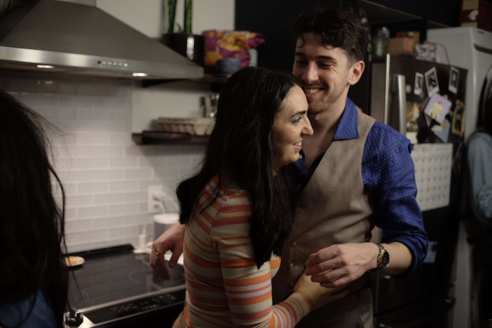

```{r setup, include=FALSE}
knitr::opts_chunk$set(echo = FALSE)
library(leaflet)
```

Jump to: &emsp; [RSVP!](cgrdn.github.io/rsvp.html) &emsp; [Schedule](#Schedule) &emsp; [Accommodation](#Accommodation) &emsp; [Locations](#Locations)

{width=49%} {width=49%}

# Schedule {#Schedule}

## Friday, September 26, 2025

__2000__: *Welcome / Pub Night*\
The Stillwell Freehouse
*2534 Agricola St.*

## Saturday, September 27, 2025

__1400__: *Ceremony*\
St. Thomas Aquinas Catholic Church\
*1725 Oxford St.*

*break*

__1630__: *Cocktail Hour*\
St. Mary's Boat Club\
*1641 Fairfield Road*

__1800__: *Reception*\
St. Mary's Boat Club\
*1641 Fairfield Road*

{width=49%} {width=49%}\

# Accommodation {#Accommodation}

More info to come - we will be getting rates for blocks of rooms from the following hotels in the new year: 

* [The Lord Nelson](https://lordnelsonhotel.ca/) (1515 South Park St.)
* [Sutton Place](https://www.suttonplace.com/halifax) (1700 Grafton St.)
* [Cambridge Suites](http://www.cambridgesuiteshalifax.com/) (1583 Brunswick St.)

# Favourite Places & Important Locations {#Locations}

_Key locations and our personal recommendations for Halifax!_ Add this as a list in [Google Maps](https://maps.app.goo.gl/riA8Z72gBKDnbhJFA) or as a guide in [Apple Maps](https://guides.apple.com/?ug=CgxBbGV4ICYgQ2hyaXMSDQiuTRC6%2Br6vt5jPt3cSDQiuTRCW0%2BihhNzD5xoSDgiuTRC%2B%2BsjQw6mesqgBEg4Irk0Q5K6XtumEoq%2BrARIOCK5NELndnr2Uwoy40QESDQiuTRD%2Bl%2Fnzivf1lTcSDgiuTRCUpPDnnLnDg5IBEg4Irk0Q882q2d225drbARIOCK5NEJjH6%2FD55LGXxAESDgiuTRCBpIH3%2Be2ho7EBEg4Irk0QwP3z75bfioW%2BARINCK5NEOOn%2BI%2Bb7pKjYxIMCK5NEMmxysees9sREg4Irk0QuOur%2BYG%2FwY7DARIOCK5NEN6K94GAtIH%2B%2BQE%3D).

```{r map, layout="l-screen"}
df <- read.csv("fav_places.csv")

logos <- awesomeIconList(
  bar = makeAwesomeIcon(
    icon = "beer-mug-empty",
    iconColor = "black",
    markerColor = "blue",
    library = "fa"
  ),
  restaurant = makeAwesomeIcon(
    icon = "martini-glass-citrus",
    iconColor = "black",
    markerColor = "blue",
    library = "fa"
  ),
  icecream = makeAwesomeIcon(
    icon = "ice-cream",
    iconColor = "black",
    markerColor = "blue",
    library = "fa"
  ),
  pizza = makeAwesomeIcon(
    icon = "pizza-slice",
    iconColor = "black",
    markerColor = "blue",
    library = "fa"
  ),
  church = makeAwesomeIcon(
    icon = "church",
    iconColor = "black",
    markerColor = "red",
    library = "fa"
  ),
  reception = makeAwesomeIcon(
    icon = "heart",
    iconColor = "black",
    markerColor = "red",
    library = "fa"
  ),
  home = makeAwesomeIcon(
    icon = "house",
    iconColor = "black",
    markerColor = "green",
    library = "fa"
  ),
  coffee = makeAwesomeIcon(
    icon = "mug-saucer",
    iconColor = "black",
    markerColor = "orange",
    library = "fa"
  ),
  hotel = makeAwesomeIcon(
    icon = "hotel",
    iconColor = "black",
    markerColor = "purple",
    library = "fa"
  )
)

m <- leaflet() %>%
  addProviderTiles(providers$CartoDB.Positron) %>%
  setView(lat = 44.65065108508493, lng = -63.593375588138834, zoom = 13) %>%
  addAwesomeMarkers(
    data = df,
    lat = ~lat, lng = ~lng,
    icon = ~logos[df$Type],
    popup = paste0(
      df$Name, "<br/>", df$Address, "<br/>Description: ", df$Description
    )
  )
m
```


{width=49%} {width=49%}\

{width=49%} {width=49%} 
